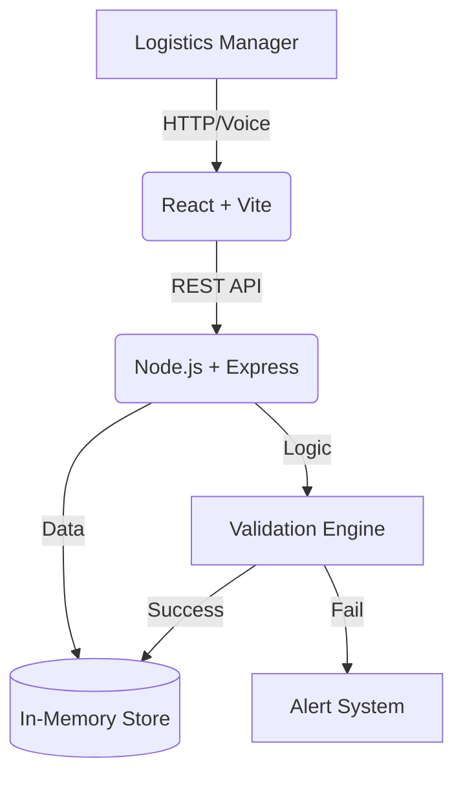

# TMMR (Transport Misroute Monitoring & Resolution)

**Deployment Status**: [](https://www.docker.com/) []()

> A full-stack LogiTech observability platform for intelligent parcel assignment, validation, and misroute prevention.

---

## 📌 Problem Statement
In the fast-paced logistics industry, **manual parcel assignment is error-prone**. Misrouting (assigning parcels to the wrong truck) and overloading (exceeding capacity) lead to:
- ❌ **Failed Deliveries**: Trucks arriving at destinations where the parcel isn't needed.
- ❌ **Wasted Resources**: Fuel and driver time spent on inefficient routes.
- ❌ **Operational Chaos**: Lack of visibility into *why* assignments are failing.

**TMMR** solves this by enforcing **validation at the source**, ensuring that every parcel assigned is routed correctly and safely.

---

## 💡 Solution Overview
TMMR provides a centralized Mission Control dashboard for logistics operations that moves from reactive error-fixing to proactive prevention.

### Key Capabilities
1. **Intelligent Validation CORE**:
   - **Route Integrity**: Automatically verifies if a parcel's destination is on the truck's scheduled route.
   - **Capacity Guard**: Checks if the truck has available weight capacity before assignment.
2. **Operational Observability**:
   - **Alert System**: Captures failed assignments as "Alerts" (SL-1 to SL-3) for review.
   - **Incident Summary**: Aggregates failure patterns (e.g., "3 failures in 10 mins") to detect systemic issues.
3. **Voice-Activated Ops (AI)**:
   - Hands-free "Zudu" assistant allows warehouse operators to query system status and get verbal reports while working.

---

## � High-Level Architecture

The system is architected for reliability and ease of deployment:



- **Frontend**: Single Page Application (SPA) built with React and Vite. Optimized for performance.
- **Backend**: Robust Node.js API server handling business logic, validation, and data persistence.
- **Data Store**: High-performance in-memory structure (simulating a fast caching layer).

---

## 🐳 Docker Implementation (Production Ready)

TMMR is fully containerized using **Docker** and **Docker Compose**, ensuring a consistent environment from development to production.

### Why Docker?
- **Isolation**: Frontend and Backend run in separate, clean containers.
- **Networking**: Containers communicate over a private Docker implementation network.
- **Simplicity**: One command to launch the entire stack.

### Docker Configuration
- **Backend (`/backend/Dockerfile`)**:
  - Base Image: `node:18-alpine` (Lightweight)
  - Exposes: Port `5000`
- **Frontend (`/frontend/Dockerfile`)**:
  - Base Image: `node:18-alpine`
  - Build Step: Compiles React to static assets (`npm run build`)
  - Server: Uses `serve` (or Nginx ready) to host static files on Port `3000`
- **Orchestration (`docker-compose.yml`)**:
  - Manages service dependencies (Frontend depends on Backend).
  - Configures environment variables (`VITE_API_BASE_URL`) dynamically.

---

## 🚀 Installation & Running

### Prerequisites
- Docker Desktop installed and running.

### Quick Start (Recommended)
Passively deploy the entire system with a single command:

```bash
# 1. Clone the repository
git clone https://github.com/SH-Nihil-Mukkesh-25/tmmr-b2b.git
cd tmmr-b2b

# 2. Start with Docker Compose
docker-compose up --build
```

**That's it!** The system is now live.

### Access Points
- **🖥️ Dashboard**: [http://localhost:3000](http://localhost:3000)
- **🔌 API Health**: [http://localhost:5000/api/health](http://localhost:5000/api/health)

*(To stop the system, press `Ctrl+C` or run `docker-compose down`)*

---

## 🤖 Voice Assistant Feature ("Zudu")

TMMR includes an experimental **Voice Assistant** to demonstrate hands-free warehouse operations.

### How it Works
1. Navigate to the **"Assistant"** tab in the dashboard.
2. Click **"Start Listening"**.
3. **Speak a command**:
   - *"Report status"* -> Reads out the number of trucks, routes, and active alerts.
   - *"Check alerts"* -> Summarizes critical alerts.
4. **Behind the Scenes**:
   - Uses the browser's **Web Speech API** for speech-to-text.
   - Parses intent and executes **Tool Calls** effectively triggering backend API requests.
   - Uses **Speech Synthesis** to read the response back to the user.

---

## ✨ Full Feature List

### 1. Dashboard & Monitoring
- Real-time counters for Routes, Trucks, Parcels, and Alerts.
- System Status Indicator (Green/Red based on Alerts).
- **Dark Mode**: Fully supported theme toggle for low-light warehouse environments.

### 2. Asset Management (CRUD)
- **Routes**: Create/Delete routes with specific stops and capacity limits.
- **Trucks**: Manage fleet, assign to routes, set max capacity.
- **Parcels**: Inventory of parcels with weight and destination.
- *Note: Delete operations are strictly validated (e.g., cannot delete a truck if it has parcels).*

### 3. Assignment & Validation
- **Smart Assignment Interface**: Dropdown selection for Parcel -> Truck.
- **Instant Feedback**: Success message or specific error reason (e.g., "Route Mismatch").

### 4. Observability Module (New v2.0)
- **Ops Summary**: View aggregated failure reasons and time-windowed incident candidates.
- **Workflows**: Inspect step-by-step execution logs of every assignment attempt.

---

## � Tech Stack
| Component | Technology |
| :--- | :--- |
| **Frontend** | React, Vite, CSS Modules |
| **Backend** | Node.js, Express.js |
| **API** | RESTful JSON API |
| **Deployment** | Docker, Docker Compose |
| **AI/Voice** | Web Speech API |

---

## ⚠️ Assumptions & Limitations
- **Data Persistence**: Data is stored **in-memory**. All data resets when the Docker containers are restarted. This is by design for a clean demo environment.
- **Authentication**: No login is required (Open Access) to facilitate easy evaluation by judges.

---

*Built for the TMMR Hackathon submission.*
