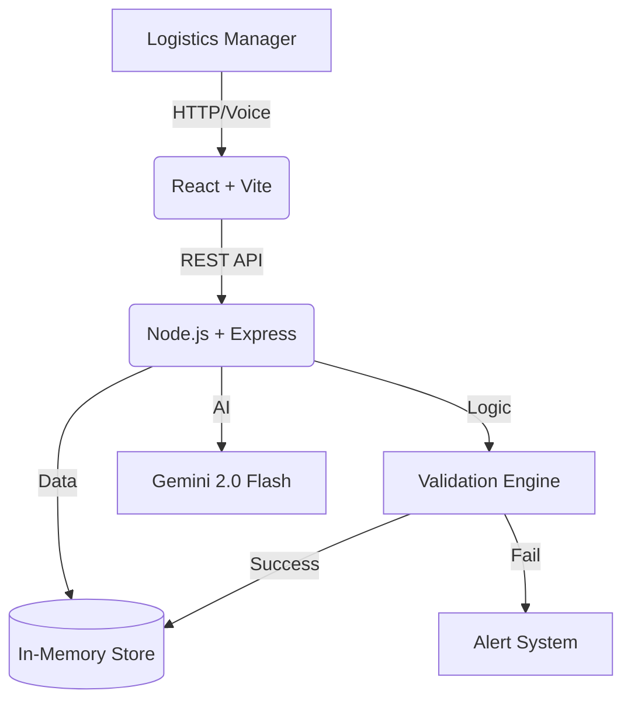

# TMMR (Transport Misroute Monitoring &amp; Resolution)

**Deployment Status**: [](https://www.docker.com/) []() []()

> A full-stack LogiTech observability platform for intelligent parcel assignment, validation, and misroute prevention.

---

## 📌 Problem Statement
In the fast-paced logistics industry, **manual parcel assignment is error-prone**. Misrouting (assigning parcels to the wrong truck) and overloading (exceeding capacity) lead to:
- ❌ **Failed Deliveries**: Trucks arriving at destinations where the parcel isn't needed.
- ❌ **Wasted Resources**: Fuel and driver time spent on inefficient routes.
- ❌ **Operational Chaos**: Lack of visibility into *why* assignments are failing.

**TMMR** solves this by enforcing **validation at the source**, ensuring that every parcel assigned is routed correctly and safely.

---

## 💡 Solution Overview
TMMR provides a centralized Mission Control dashboard for logistics operations that moves from reactive error-fixing to proactive prevention.

### Key Capabilities
1. **Intelligent Validation CORE**:
   - **Route Integrity**: Automatically verifies if a parcel's destination is on the truck's scheduled route.
   - **Capacity Guard**: Checks if the truck has available weight capacity before assignment.
2. **Operational Observability**:
   - **Alert System**: Captures failed assignments as "Alerts" (SL-1 to SL-3) for review.
   - **Incident Summary**: Aggregates failure patterns (e.g., "3 failures in 10 mins") to detect systemic issues.
3. **AI-Powered Voice Assistant (Gemini 2.0)**:
   - Natural language processing for operations management
   - Full CRUD capabilities via voice/chat commands
   - Hands-free warehouse operations

---

## 🆕 New Features (v2.5)

### 🗺️ Interactive Operations Map (Leaflet)
- **OpenStreetMap Integration**: Free, no API key required
- **Colored Route Polylines**: Each route displayed with unique colors
- **Stop Markers**: Circular markers at each city/stop
- **Truck Markers**: Real-time truck positions with load info
- **Side Panel**: Route details, truck assignments, parcel counts

### 🤖 Advanced AI Agent (Gemini 2.0 Flash)
The "Zudu" assistant now supports **full CRUD operations**:

| Category | Commands |
|----------|----------|
| **Query** | "What's the system status?", "List all trucks", "Show parcels" |
| **Create** | "Create a parcel P-001 going to Chennai, 15kg" |
| **Assign** | "Assign parcel P-001 to truck T-101" |
| **Alerts** | "Any critical alerts?" |

**Features**:
- Natural language understanding
- Automatic tool execution
- Fallback to basic mode on AI unavailable
- Processing indicators

### 🚀 One-Click Demo Data Loader
- Floating rocket button (🚀) in bottom-left corner
- Loads test data: 3 Routes, 4 Trucks, 4 Parcels
- Modal confirmation with loading states
- Auto-refresh after loading

---

## 🏗️ High-Level Architecture



- **Frontend**: React SPA with Vite, Leaflet maps, voice integration
- **Backend**: Node.js API with Express, Gemini AI SDK
- **Data Store**: High-performance in-memory structure

---

## 🐳 Docker Implementation (Production Ready)

### Quick Start
```bash
# 1. Clone the repository
git clone https://github.com/SH-Nihil-Mukkesh-25/tmmr-b2b.git
cd tmmr-b2b

# 2. Start with Docker Compose
docker-compose up --build
```

### Access Points
- **🖥️ Dashboard**: [http://localhost:3000](http://localhost:3000)
- **🔌 API Health**: [http://localhost:5000/api/health](http://localhost:5000/api/health)
- **🤖 AI Status**: [http://localhost:5000/api/ai/status](http://localhost:5000/api/ai/status)

---

## 🔧 Environment Setup

### Backend (.env)
```env
GEMINI_API_KEY=your_gemini_api_key_here
PORT=5000
```

### Frontend (.env)
```env
VITE_API_BASE_URL=http://localhost:5000/api
```

---

## 🤖 Voice Assistant Feature ("Zudu")

### Basic Mode (No API Key)
- Static command recognition
- Commands: "system status", "alerts", "assign parcel X to truck Y"

### Advanced AI Mode (With Gemini)
1. Navigate to **"Assistant"** tab
2. Enable **"Advanced AI Mode (Gemini)"** toggle
3. Speak or type naturally:
   - *"Create a parcel with ID P-100 going to Salem, 20kg"*
   - *"What trucks are available?"*
   - *"Assign parcel P-100 to truck T-102"*

---

## ✨ Full Feature List

### 1. Dashboard &amp; Monitoring
- Real-time counters for Routes, Trucks, Parcels, and Alerts
- System Status Indicator (Green/Red based on Alerts)
- **Dark Mode**: Fully supported theme toggle

### 2. Asset Management (CRUD)
- **Routes**: Create/Delete routes with specific stops
- **Trucks**: Manage fleet, assign to routes, set max capacity
- **Parcels**: Inventory of parcels with weight and destination
- **Inline Delete**: Quick delete buttons on each item

### 3. Operations Map
- **Leaflet + OpenStreetMap**: Interactive map visualization
- **Route Lines**: Color-coded polylines for each route
- **Truck Markers**: Real-time positions with popup details
- **Side Panel**: Route selection, truck info, load percentages

### 4. Assignment &amp; Validation
- **Smart Assignment Interface**: Dropdown selection for Parcel → Truck
- **Instant Validation**: Route match + capacity check
- **Feedback**: Success message or specific error reason

### 5. Observability Module
- **Ops Summary**: Aggregated failure reasons
- **Workflows**: Step-by-step execution logs of assignments

---

## 🛠️ Tech Stack

| Component | Technology |
| :--- | :--- |
| **Frontend** | React 19, Vite, Leaflet, CSS |
| **Backend** | Node.js, Express.js, Helmet, Morgan |
| **AI** | Google Gemini 2.0 Flash |
| **Maps** | Leaflet + OpenStreetMap |
| **Deployment** | Docker, Docker Compose |
| **Voice** | Web Speech API |

---

## 📁 Project Structure

```
tmmr-b2b/
├── backend/
│   ├── routes/api.js          # All API endpoints + AI agent
│   ├── data/store.js          # In-memory data store
│   ├── server.js              # Express server
│   └── .env                   # Environment variables
├── frontend/
│   ├── src/
│   │   ├── components/        # Reusable components
│   │   ├── pages/             # Page components
│   │   └── api/config.js      # API configuration
│   └── .env                   # Frontend environment
├── docker-compose.yml
└── README.md
```

---

## ⚠️ Assumptions &amp; Limitations
- **Data Persistence**: Data is stored **in-memory**. All data resets when containers restart.
- **Authentication**: No login required for easy hackathon evaluation.
- **AI Quota**: Gemini API has usage limits; fallback to basic mode if exceeded.

---

*Built for the TMMR Hackathon Challenge | Powered by Google Gemini 2.0*
